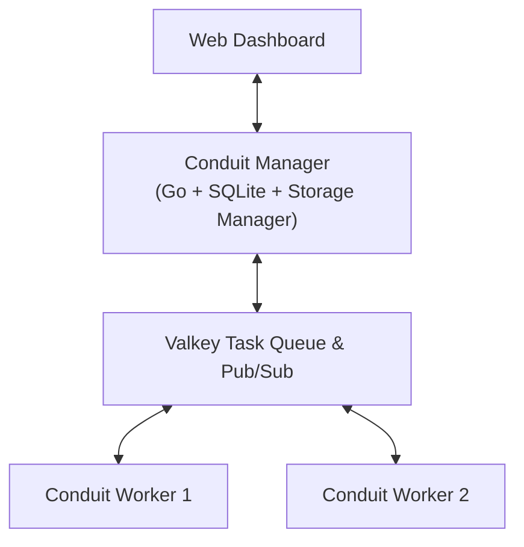

# Conduit

Distributed Node-Based File Processing Utility

**Conduit** is an open-source node-based utility designed to process, transcode, transform, route, and analyze any file type across distributed processing nodes.

## Getting Started

### Run via Docker / Podman Compose

```bash
docker compose -f docker/docker-compose.yml up -d
```
Access the UI at http://localhost:5252.


### Run Conduit Manager & Worker Locally

```bash
# Run Conduit Manager
go run ./cmd/manager

# Run Conduit Worker Daemon
go run ./cmd/worker
```
Access the UI at http://localhost:5252.

## Project Structure



* **Backend**: Go (Golang 1.24+) - Conduit Manager & Worker daemons (`cmd/`, `internal/`)
* **Frontend**: Svelte 5 & Tailwind (`ui/`)
* **Database**: Embedded SQLite (`internal/db/`)
* **Task Queue**: Valkey (or Redis)


## Building the Project

### Prerequisites

* **Go**: 1.24+
* **pnpm** (or Node.js / npm)
* **Docker / Podman** *(optional)*

### Build Commands

```bash
# Build frontend UI bundle
cd ui
pnpm install
pnpm build

# Go back to project base directory
cd ..

# Build Conduit Manager binary
go build -o bin/conduit-manager ./cmd/manager

# Build Conduit Worker binary
go build -o bin/conduit-worker ./cmd/worker
```

## License

This work is licensed under the GNU General Public License v3.0 (GPLv3).

See `LICENSE` for details.
