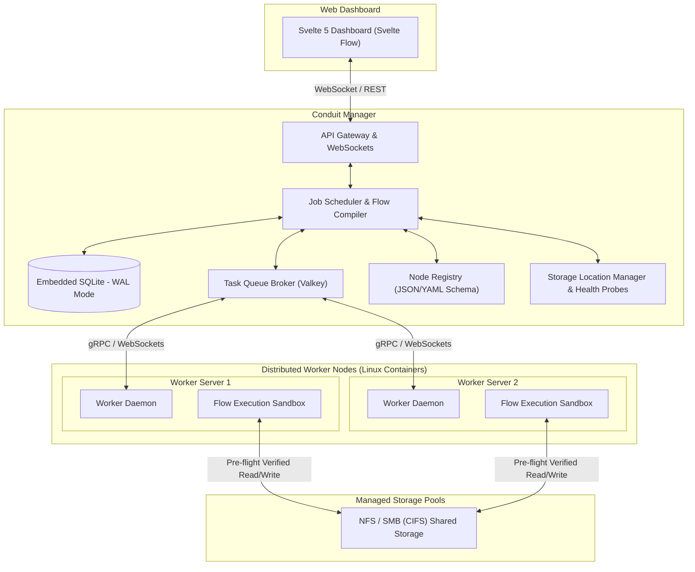

# System Architecture & Infrastructure Plan — Conduit

Conduit is an open-source, scalable, distributed node-based file processing platform capable of transforming, analyzing, routing, and processing files of any type across distributed processing nodes.

---

## 1. System Overview & Core Architecture

Conduit operates on a **Conduit Manager (Server)** and **Conduit Worker** model driven by a visual **Directed Acyclic Graph (DAG)** execution engine.

---

## 2. Component Names & Stack

* **Conduit Manager**: Central server managing flow canvas graphs, SQLite DB, task scheduling, storage health probes, and worker dispatching.
* **Conduit Worker**: Processing node agent that executes flow node steps in container sandboxes and reports hardware capabilities.
* **Conduit UI**: Svelte 5 visual flow canvas and management dashboard.
* **Language & Stack**: Go (Golang) backend (`cmd/`, `internal/`), Svelte 5 frontend (`ui/`), SQLite database, Valkey task queue, gRPC/WebSocket streaming.
